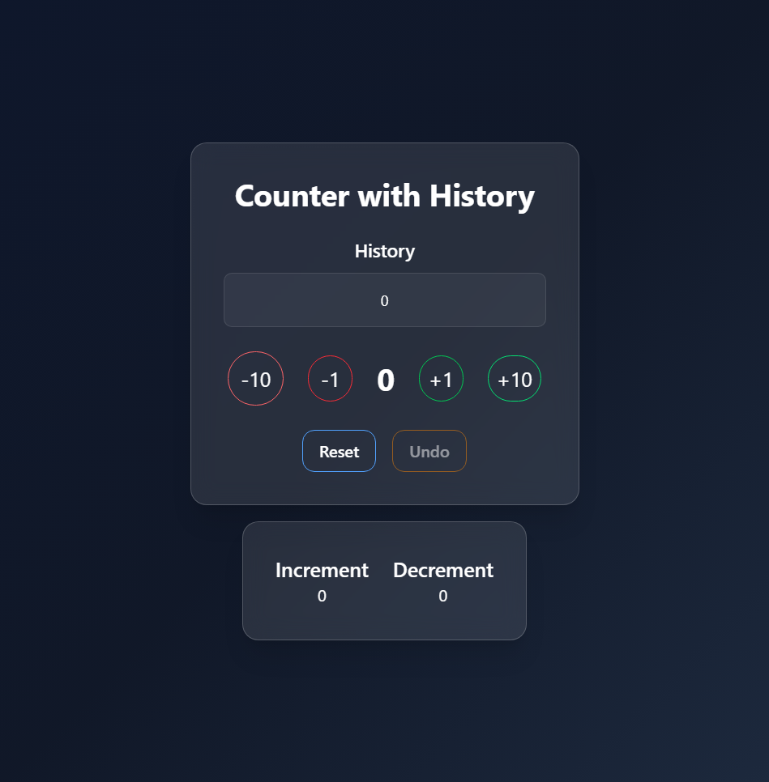
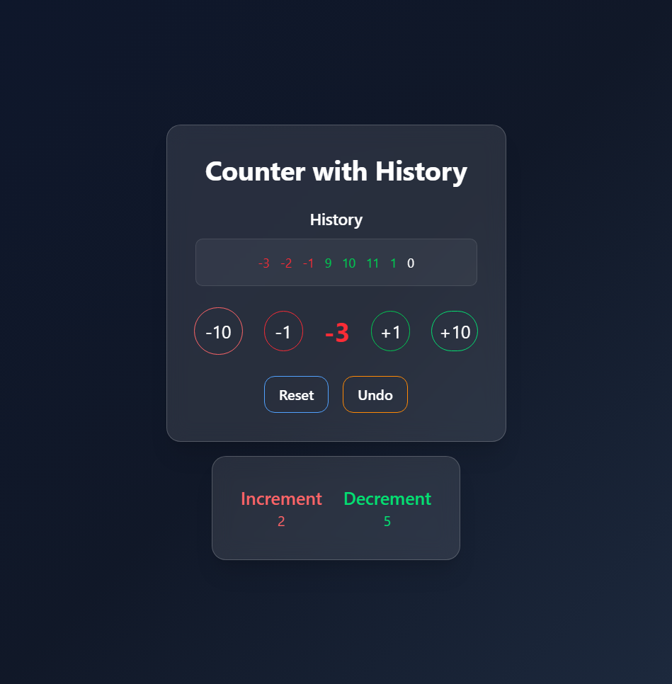

# Counter with History

A simple React project focused on practicing fundamental concepts such as component logic, state management, custom hooks, and UI organization.

---

## 📚 Table of Contents

- [Project Description](#Project-Description)
- [Main Features](#main-features)
- [What I Learned](#what-i-learned)
- [Tech Stack](#tech-stack)
- [Screenshots](#screenshots)
- [Future Improvements](#future-improvements)

---

## 📝 Project Description

This project is a small counter application built to practice the basics of React and TypeScript.  
It includes simple state manipulation, component communication, and UI updates based on user actions.

---

## ⭐ Main Features

- Counter starting at **0**.
- **Increment** and **decrement** buttons.
- A **history** that tracks every value the counter has gone through.
- **Reset** button (clears the counter and the history).
- **Undo** button to revert to the previous value.
- A display showing how many times the counter has **increased vs. decreased**.

---

## 🎯 What I Learned

- Improved my understanding of **`useState`**.
- Used a **custom hook** to separate component logic and keep the codebase clean.
- Practiced **communication between components**.
- Worked with **event handling** using `onClick`.
- Rendered lists using **`.map()`**.
- Wrote strongly typed components with **TypeScript**.
- Applied **clean code principles**.
- Organized the project following a clear folder structure.
- Built a **responsive design** with Tailwind CSS.

---

## 🧰 Tech Stack

- **Vite**
- **React + TypeScript**
- **Tailwind CSS**

---

## 📸 Screenshots

---

## 🚀 Future Improvements

- Input field to jump directly to a specific number.
