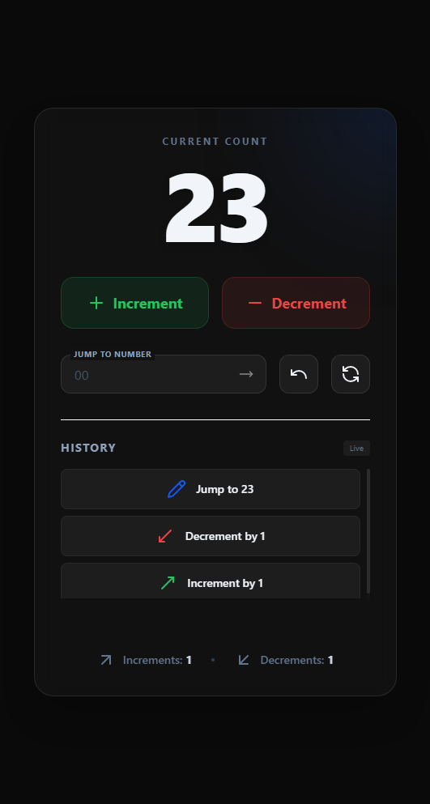

# Counter with History

    

A React application demonstrating fundamental concepts including state management, custom hooks, and component architecture.

---

## 📋 Table of Contents

- [Screenshots](#-screenshots)
- [About](#-about)
- [Features](#-features)
- [Tech Stack](#-tech-stack)
- [Skills Demonstrated](#-skills-demonstrated)
- [Project Structure](#-project-structure)
- [Getting Started](#-getting-started)

---

## 📸 Screenshots

<div align="center">



</div>

---

## 📖 About

This project showcases my understanding of React fundamentals through a practical counter application. Built as part of my learning journey, it demonstrates clean code practices, proper state management, and modern frontend development techniques.

---

## ✨ Features

| Feature | Description |
|---------|-------------|
| **Counter** | Starts at 0 with increment/decrement functionality |
| **History Tracking** | Records every value the counter passes through |
| **Undo Action** | Reverts to the previous counter value |
| **Reset** | Clears both counter and history |
| **Statistics** | Displays increment vs. decrement count |

---

## 🛠️ Tech Stack

| Technology | Purpose |
|------------|---------|
| **React 18** | UI Library |
| **TypeScript** | Type Safety |
| **Vite** | Build Tool |
| **Tailwind CSS** | Styling |
| **Lucide React** | Beautiful icons |


---

## 🎯 Skills Demonstrated

- **State Management** — Effective use of `useState` for complex state logic
- **Custom Hooks** — Separation of concerns through reusable hook patterns
- **Component Architecture** — Clean communication between components
- **TypeScript** — Strongly typed props and state
- **Responsive Design** — Mobile-first approach with Tailwind CSS
- **Clean Code** — Readable, maintainable, and well-organized codebase

---

## 📁 Project Structure

```
src/
├── components/
│   ├── ActionButtons.tsx
│   ├── CounterControls.tsx
│   ├── CounterDisplay.tsx
│   ├── HistoryItem.tsx
│   ├── HistorySection.tsx
│   ├── JumpToNumber.tsx
│   └── Statistics.tsx
├── constants/
│   └── styles.ts
├── hooks/
│   └── useCounter.ts
├── AppCounter.tsx
├── main.tsx
└── index.css
```

---

## 🚀 Quick Start

```bash
npm install && npm run dev
```

Open [http://localhost:5173](http://localhost:5173) in your browser.

---

## 👤 Author

**Jose Manuel Gijón**

- GitHub: [@josegijon](https://github.com/josegijon)
- LinkedIn: [Jose Manuel Gijón Almazán](https://www.linkedin.com/in/jose-manuel-gijón-almazán-bb804124b)